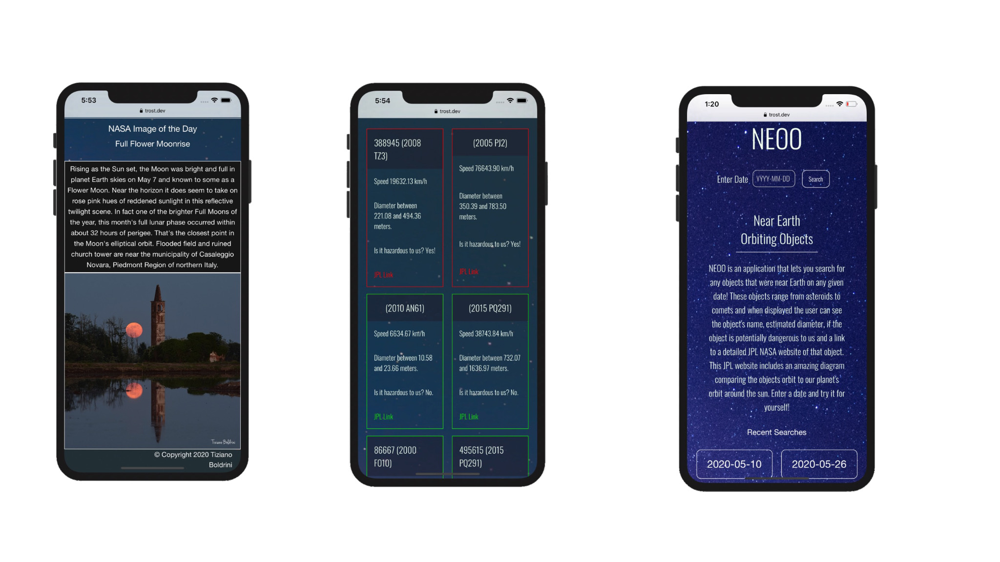

# [NEOO Deployed Site](https://trost.dev/NEOO)
### Collaborative project developed by:
   [JC Izquierdo](https://github.com/jcizquierdo)
   [Russell Morgan](https://github.com/rhmorganjr)
   [Vanessa Gonzales](https://github.com/vxnessa)
   [Conrad Trost](https://github.com/retro1967)
#
### NEOO Near Earth Orbiting Objects NASA Application allows a user to look up nearby space objects  on a selected date. Also view the NASA Image of the Day on the homepage!

### This application was built from scratch using [Foundation framework](https://get.foundation), [NASA APOD API](https://api.nasa.gov/), [NASA NeoWS API](https://api.nasa.gov/), and jQuery.
#

