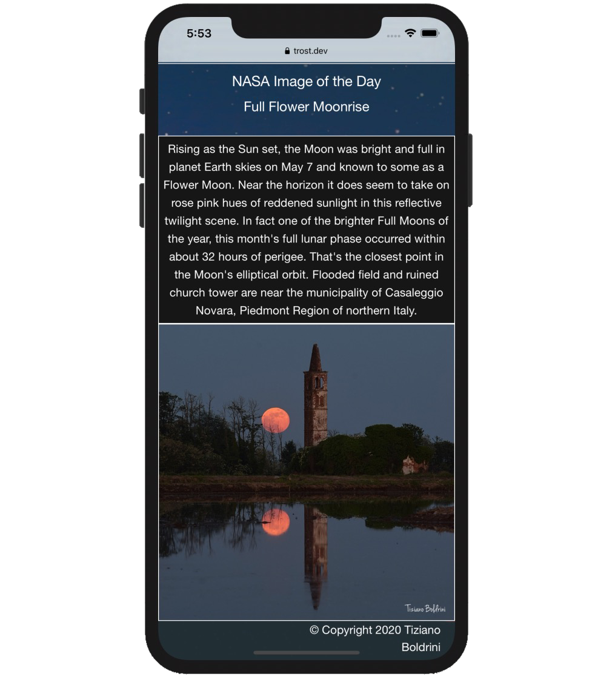
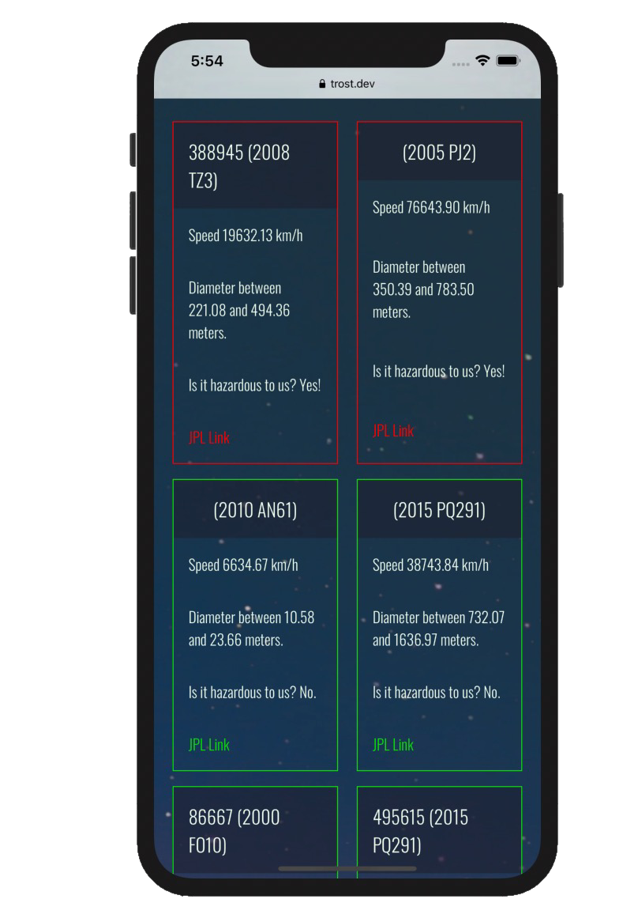

# [NEOO Deployed Site](https://trost.dev/NASA-Application)
### Collaborative project developed by JC Izquierdo, Russell Morgan, Vanessa Gonzales, and Conrad Trost
# 
### NEOO Near Earth Orbiting Objects NASA Application allows a user to look up nearby space objects  on a selected date. Also view the NASA Image of the Day on the homepage!
# 
### This application was built from scratch using Foundation framework, jQuery, NASA APOD API, and NASA NeoWS API.
#

| --- | --- | --- |
 |  | 

  
  
  

